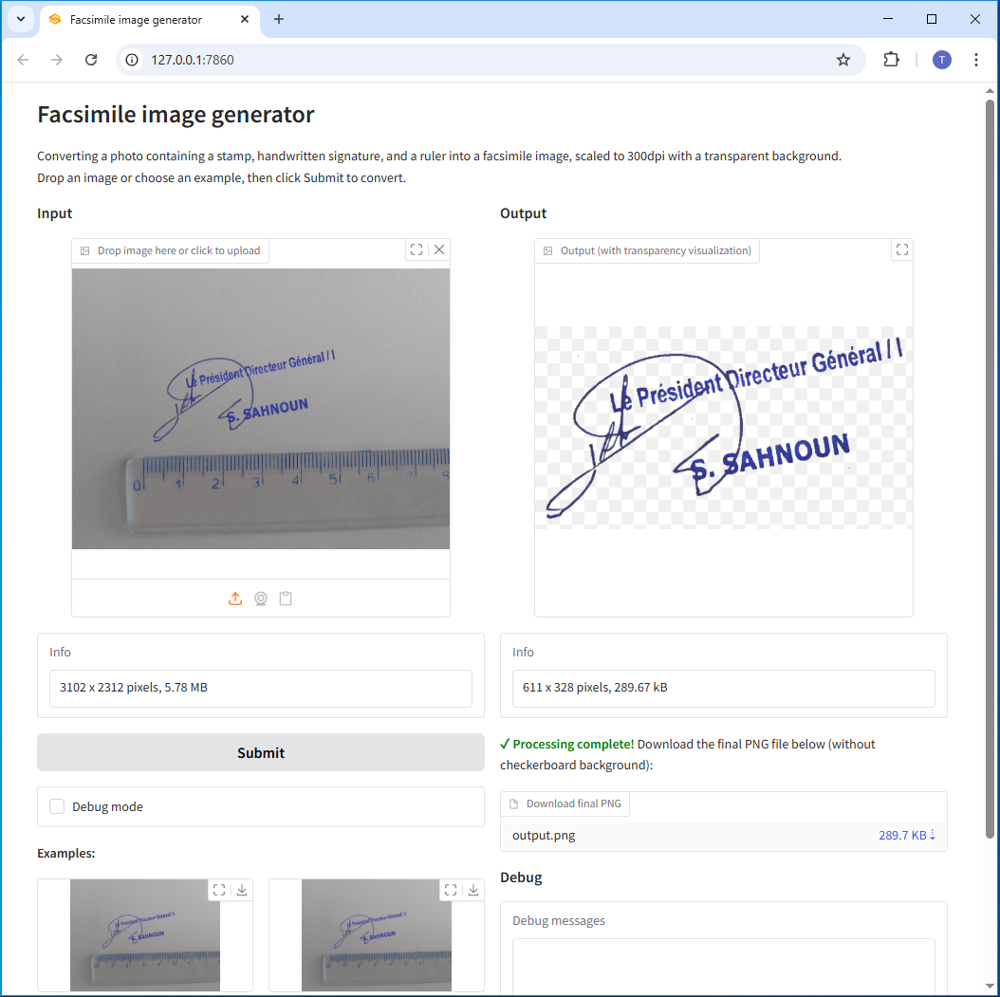

# Signature Stamp Scaler

A Python application for processing and scaling signatures/stamps in images using computer vision techniques.



*The web interface showing the main concept: upload an image with a signature/stamp and ruler, get a processed output with transparent background and proper scaling.*

## Features

- Image processing with ruler detection for scaling
- Gradio web interface for easy usage
- Support for various image formats
- Debug mode for troubleshooting

## Requirements

- Python 3.11+
- See `requirements.txt` for full dependency list

## Installation

1. Clone the repository:
```bash
git clone https://github.com/thupalo/signature-stamp-scaler.git
cd signature-stamp-scaler
```

2. Install dependencies:
```bash
pip install -r requirements.txt
```

## Usage

### Web Interface (Gradio)

**Local Access Only:**
```bash
python ruler_gradio.py --local
```

**Network Access (accessible from other computers):**
```bash
python ruler_gradio.py
```

**Custom Host and Port:**
```bash
python ruler_gradio.py --host 192.168.1.100 --port 8080
```

**Public Share Link (via Gradio's tunneling service):**
```bash
python ruler_gradio.py --share
```

**Web Interface Options:**
- `--host` - Specify host IP (default: 0.0.0.0 for all interfaces)
- `--port` - Specify port number (default: 7860)
- `--share` - Create public Gradio share link for internet access
- `--local` - Run in local-only mode (127.0.0.1)

**Accessing from Other Computers:**
1. Find your computer's IP address: `ipconfig` (Windows) or `ifconfig` (Linux/Mac)
2. Ensure Windows Firewall allows the port (default 7860)
3. Other computers can access via: `http://YOUR_IP:7860`

### Command Line
The command line interface processes images by detecting rulers, cropping the image, and saving it with the correct scale.

**Basic Usage:**
```bash
python ruler_01.py input_image.jpg output_image.png
```

**Command Line Arguments:**
- `input_path` - Path to input image (JPEG or PNG format)
- `output_path` - Path to output PNG file (will auto-append .png if not specified)

**Options:**
- `-d, --debug` - Enable debug output for troubleshooting
- `--overwrite` - Overwrite output file if it exists without prompting

**Examples:**
```bash
# Basic usage
python ruler_01.py examples/image.jpg processed_output.png

# With debug mode enabled
python ruler_01.py examples/image.jpg output.png --debug

# Overwrite existing file without prompt
python ruler_01.py input.jpg output.png --overwrite
```

**Supported Input Formats:** `.jpg`, `.jpeg`, `.png`  
**Output Format:** `.png` (automatically enforced)

## Dependencies

- Pillow - Image processing
- OpenCV - Computer vision operations
- NumPy - Numerical operations
- Matplotlib - Plotting and visualization
- Gradio - Web interface
- Requests - HTTP requests

## Project Structure

- `ruler_01.py` - Main processing module
- `ruler_gradio.py` - Gradio web interface
- `requirements.txt` - Python dependencies
- `examples/` - Example images for testing

## License

This project is available under the MIT License.
